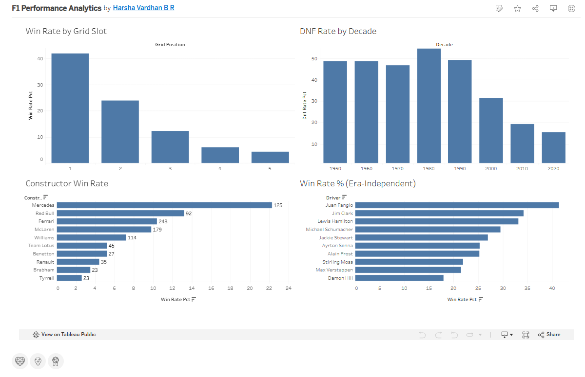

# Formula 1 Performance Analytics – SQL + Tableau

Analysis of Formula 1 race history (drivers, constructors, circuits) using SQL, with a Tableau dashboard.

## Original project (summary)

- Relational model of 7 tables: circuits, constructor_results, constructor_standings, drivers, driver_standings, races, results.
- SQL analysis: most races, career points, average points per race, average finishing position (min 20 races), fastest laps by track, performance quartiles with `NTILE`, experience buckets with `CASE`.
- Tableau dashboard with six views (see `f1-dashboard-preview.png`).

## My contributions (`my-extensions/`)

| # | What | File |
|---|------|------|
| 1 | **Reproduced the original results** by loading the dataset and re-running the key queries. Headline numbers match: Alonso 358 races, Hamilton 4,396.5 points, Ascari best average finish 2.18, Mazepin worst 17.8, Sainz fastest lap 1:05.619 at the Red Bull Ring. | `run_extensions.py`, `results/run_output.txt` |
| 2 | **Found a scope discrepancy:** the README says 1953–2020, but the numbers only reproduce when seasons through **2022** are included (Alonso's 358 races, Hamilton's 4,396.5 points). | `run_extensions.py` (`last_year` argument) |
| 3 | **Improved schema:** `points` as `DECIMAL` (original `INT` truncates half-points), primary keys, foreign keys, indexes, nullable `position`, numeric `fastestLapSeconds` column. Foreign-key check passes on the full load. | `01_schema_improved.sql` |
| 4 | **Fixed the constructor analysis:** the original joined `results` to `constructor_results` on `constructorId` only, multiplying rows. Mine joins to `constructors`, counts `DISTINCT raceId`, and shows constructor names. | `02_extension_queries.sql` (Q2, Q3) |
| 5 | **Fastest laps in seconds** instead of text, with the 2020 Sakhir GP (outer-layout anomaly, RaceID 1046) excluded by race name. | Q1 |
| 6 | **New analysis:** era-independent driver ranking (win % and podium %), DNF rate per decade, top retirement reasons 1950s vs 2010s, most successful driver per decade (window functions), and win rate by grid slot. | Q4–Q8 |
| 7 | **Charts** exported from the query results. | `my-extensions/charts/` |

### My Tableau dashboard

Built in Tableau Public from `my-extensions/results/` (Q3, Q4, Q5, Q8): win rate by grid slot, DNF rate by decade, constructor win rate, and era-independent driver win rate.



### Key findings from the new analysis

- **Reliability improved massively:** DNF rate fell from about 49% in the 1950s to about 19% in the 2010s. Engine failure was the top retirement reason in the 1950s (237 cases); in the 2010s it was collisions.
- **Pole position matters:** 41.8% of pole sitters win, vs 23.9% from P2 and 4.4% from P5.
- **Win rate tells a different story from total points:** Fangio (41.4%) and Clark (34.2%) rank above Hamilton (33.2%) and Schumacher (29.5%), reducing the bias from points systems changing over time. Hamilton still leads on podium rate (61.6%).
- **Constructors:** Ferrari has the most wins (243), but Mercedes has the highest win rate (22.3%, min 100 entries).

### How to run

```bash
pip install matplotlib
python my-extensions/run_extensions.py <folder-with-F1-CSVs> 2022
```

The script loads the CSVs into an in-memory SQLite database using `01_schema_improved.sql`, runs `02_extension_queries.sql`, and writes CSVs to `my-extensions/results/` and charts to `my-extensions/charts/`. The SQL is plain SQL and also works in MySQL 8 (untested there: swap `||` for `CONCAT` in Q4 and Q7, and `year / 10` for `year DIV 10` in Q5–Q7, because MySQL's `/` is not integer division). The CSVs are not committed, so download them from the Kaggle dataset first.

### Limitations

- Average finish ignores DNFs and does not account for car quality.
- DNF definition: status other than "Finished" or "+N Laps", excluding non-starters (DNQ, withdrew).
- `f1-dashboard-preview.png` in the repo root is the original author's dashboard; the dashboard above is my own, built on my extension CSVs. It uses bar charts only, with no filters or map.
- Extension code was written with help from an AI assistant (Claude) and verified by running it against the data.
